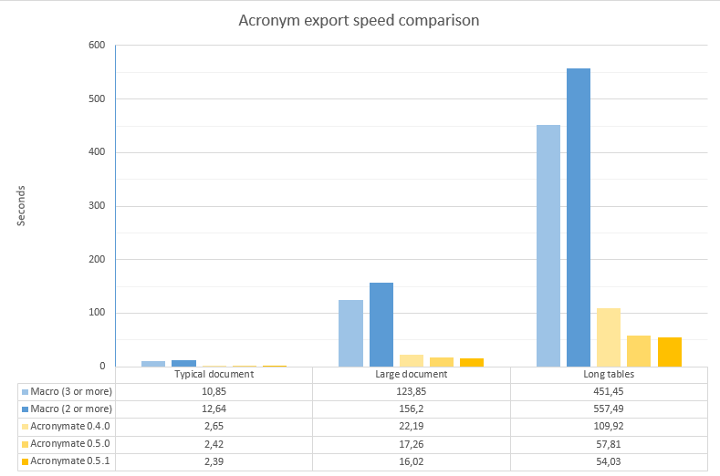

# Acronymate
Helpful script to quickly extract acronyms from word documents and aid in the generation of definition tables

## What is its purpose?
This script was created after the tedious task of reviewing several documents at work and having to extract and define the same acronyms in all of them.

The script extracts the acronyms from any *.docx* file. It analyzes all paragraphs and tables, including those with "Track Changes" enabled. Acronymate also provides a "database" for definitions to ensure consistency. Once a new acronym is added its definition will appear automatically the next time it is found in another document. This way no time is wasted in manually searching everytime how exactly that acronym was defined. Finally, it generates an acronym table in *.docx* format that eases copying it to the final document.

It also detects and process an already existing acronym table to import new definitions and avoid detecting those listed acronyms as needed if they only appear in that table.

The script is thought to be used with colleagues keeping the database file in a shared folder. Some degree of protection is added to prevent overwriting others changes.

The current user interface is a plain console, but with plenty of options and quite user-friendly. For example, for each acronym all of its appearances are shown, including context. Then it's easy to see where it was used on the document. The interface looks like this:  

The user interface is provided in english and spanish. Use the configuration menu or file to change the language.
If you are processing documents that are not in the supported languages, please check if the regex in *common/defines* contains all the special characters your language uses.

### Efficiency benchmark
The script does not only speed up the generation of definition tables, it also saves time when only extracting acronyms from a document to an empty table. 
To gauge the speed of the script, it was measured against the famous "Extract ACRONYMS to New Document" Word macro.

The following documents were used as benckmark:

| Document | Description | Word count | Pages | File size [KB] |
| --- | --- | --- | --- | --- |
| Typical document | Short document, mostly text  | 8.621 | 28 | 444 |
| Large document | Long, with multiple tables and images | 50.893 | 220 | 21.181 |
| Long tables | Document with several pages long tables (Requirement specification document)  | 219.489 | 539 | 11.124 |

Documents are real, but work related, so they can not be shared.

For each one, their acronyms were extracted to an empty table.
A timer starts as the macro is launched (Check ["Word integration"](#word-integration) below for Acronymate) and stops when the results document is open.
The macro was executed both configured to detect an acronym as a word consisting of 3 or more uppercase letters and 2 or more uppercase letters. Acronymate by default is configured for 2 or more uppercase letters. 
The resulting time on the chart is the average of 3 runs, in seconds.

Clearly the script processes the documents orders of magnitude faster than a plain word macro. The speed boost is very noticeable for long documents.
Also, the processing time was almost halved after the v0.5.0 release.

Finally, regarding accuracy, all the acronyms detected by the macro were detected by Acronymate.

# How to use
Launch *acronymateCmd.py*, or the precompiled executable for Windows, and follow the instructions of the user interface.
Currently, all user interaction is done through the console. Use the command 'h' for help. 

## Word Integration
To facilitate its use a Word macro is available [here](other/Word_Integration_Macro.txt).
This macro allows for launching Acronymate directly from the document whose acronyms want to be extracted.
Removing the need of looking for the executable and entering the document path saves a lot of time.

Before using the macro some variables need to be defined. Read the comments on the same file.

## Requirements (Python script)
To run the program as a python script the modules *python-docx* and *lxml* are required. Their versions are specified in the *requirements.txt* file.

# Status
Currently, the script is very polished and the core works well. However, there is still some room for improvement before a v1.0.0 release.
I have several improvements in my TODO list like better support for multiple users (Keeping track if the "database" is in use), upgrading the console to a GUI, etc.

If the script proves to be useful I will invest more time to it.

### And, what does the name mean?
Acronym + mate :)